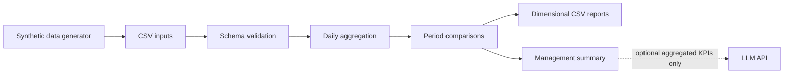

# Synthetic Retail Analytics Pipeline

## Overview

This project demonstrates a reproducible batch analytics pipeline for daily retail reporting. It validates synthetic transaction and inventory data, calculates operational KPIs, produces dimensional reports, and can generate a concise management summary.

This repository is an independent portfolio implementation created using synthetic data. It does not contain proprietary source code, confidential datasets, internal infrastructure details, or other non-public information from any employer or client.

## Problem Statement

Daily reporting often combines transaction and inventory data with different grains. A reliable pipeline must validate both sources, calculate ratios from correctly aggregated numerators and denominators, compare periods consistently, and create outputs that are easy to consume in a BI tool.

## Approach

The pipeline:

1. loads CSV inputs with explicit schemas;
2. validates required columns and numeric values;
3. filters completed transactions;
4. calculates daily sales and inventory metrics;
5. creates overall and dimensional snapshots;
6. compares the report date with the previous day and the previous seven observed days;
7. writes tidy CSV outputs and a short management summary.

Average order size is calculated as total units divided by distinct orders. Waste rate is calculated from aggregated quantities: total waste divided by total received quantity. Historical rate comparisons first calculate each daily rate and then average the valid daily rates.

## Architecture



## Technologies

- Python 3.10+
- pandas and NumPy
- Python unittest
- Optional OpenAI-compatible API integration
- GitHub Actions

## Project Structure

```text
.
├── data/
│   ├── README.md
│   └── synthetic/
├── docs/
│   └── architecture.md
├── outputs/
├── scripts/
│   └── generate_synthetic_data.py
├── src/retail_analytics/
│   ├── cli.py
│   ├── insights.py
│   ├── metrics.py
│   └── pipeline.py
├── tests/
├── .env.example
└── pyproject.toml
```

## Dataset

All included data is synthetic and generated by `scripts/generate_synthetic_data.py` with a fixed random seed. Location IDs, transactions, quantities, categories, and revenue values are fictional. The generator does not use or reproduce a private database schema.

## Installation

```bash
python -m venv .venv
```

Activate the environment on Windows:

```powershell
.\.venv\Scripts\Activate.ps1
```

Install the project:

```bash
python -m pip install -e .
```

For the optional AI summary:

```bash
python -m pip install -e ".[ai]"
```

## Usage

Generate deterministic sample data:

```bash
python scripts/generate_synthetic_data.py
```

Run the latest available date:

```bash
retail-analytics
```

Run a specific date:

```bash
retail-analytics --report-date 2026-08-25
```

Run tests:

```bash
python -m unittest discover -s tests -v
```

The optional LLM path is disabled by default. Set the variables shown in `.env.example` in your local shell or secret manager, then pass `--use-llm`. Only aggregated KPIs are sent; raw transaction rows are not included.

## Results

Each run creates four analysis-ready outputs:

- `daily_overall.csv`: overall sales and inventory KPIs;
- `sales_by_location_customer.csv`: sales by location and customer segment;
- `sales_by_location_product.csv`: sales by location and product category;
- `inventory_by_location_product.csv`: inventory and waste KPIs by location and product category.

It also creates `management_summary.txt`. Results describe the included synthetic dataset only and must not be interpreted as production business performance.

## Limitations

- Inputs are local CSV files rather than a production database or streaming source.
- The sample has no personally identifiable information.
- Period comparisons use observed calendar days and do not model local holiday or trading-hour rules.
- The project does not demonstrate deployment, distributed processing, monitoring, or automated retraining.
- Optional LLM output is qualitative and should be reviewed by a person.

## Future Improvements

- Add a database adapter with migration tests.
- Add data-contract validation with a dedicated schema library.
- Add incremental processing and idempotency tests.
- Add BI-ready Parquet output and data lineage metadata.
- Add evaluation tests for generated summaries.

## Author

Ahmad Rasti Barzoki

- GitHub: https://github.com/ahmadrasti
- LinkedIn: https://linkedin.com/in/ahmad-rasti-barzoki
## Example Output
A deterministic run over the repository's synthetic CSV inputs writes the following analysis-ready artifacts:
| Output file | Granularity | Example use |
|---|---|---|
| `daily_overall.csv` | Report date | Review overall sales and inventory KPIs |
| `sales_by_location_customer.csv` | Location × customer segment | Compare segment performance by location |
| `sales_by_location_product.csv` | Location × product category | Inspect category-level sales patterns |
| `inventory_by_location_product.csv` | Location × product category | Review inventory and waste KPIs |
| `management_summary.txt` | Report date | Read a concise synthetic-data management summary |

